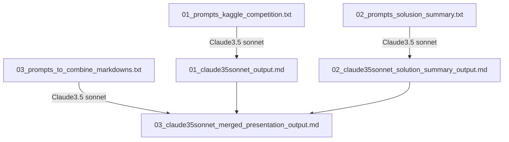

# LLM-->Pandocでの発表スライド（半）自動生成
[Kaggle LLM Prompt Recovery](https://www.kaggle.com/competitions/llm-prompt-recovery/overview)における我々の[12th解法](https://www.kaggle.com/competitions/llm-prompt-recovery/discussion/494526)紹介スライドを作成する場面を例に.

## Workflow Diagram



## Usage
### 1. **Claude3.5 sonnetへのプロンプトをテキストで用意**
- ChatGPT4oも試したが，どちらもURLの内容読み込みが甘かったため, べた貼り. (要改善)
- 英語の方が良質な出力を期待できる気がしているのでとりあえず英語 (winner's callとかは英語だし.)
- `prompts.md`

### 2. Claude3.5 sonnetが出力した`.md`
- 最初は英語の出力なので, "同じ内容を日本語で出力してください"と指示.
- 今回はなぜか途中で切れたりしたため, 手作業でコピペ (要改善)

- `claude35sonnet_output_ja.md`

### 3. (Optional)スライドテンプレートを用意
- [ここ](https://yyhhyy.hatenablog.com/entry/2019/10/22/100000)を参考にした.
- `template.pptx`
- 今回は特にこだわりはない
    - スライドマスターにて設定.
    - 比16:9, 日本語メイリオ, 英語Arial, スライド番号挿入くらい.
    - コーポレートカラーやデザインがあれば.
- Markdownレベル1は以下について，予めフォントサイズを指定しておくと便利 (フォントサイズ48)

- Markdownレベル2は以下について，予めフォントサイズを指定しておくと便利 (タイトル36, 第2レベル18, 行間オプション倍率1.1にした.)


### 4. Pandoc
- install (私の環境: WSL2 Ubuntu 22.04.3 LTS)
```bash
sudo apt update
sudo apt install pandoc
```
- 以下を実行
```bash
pandoc -s claude35sonnet_output_ja.md -o kaggle_presentation.pptx --reference-doc=template.pptx
```
